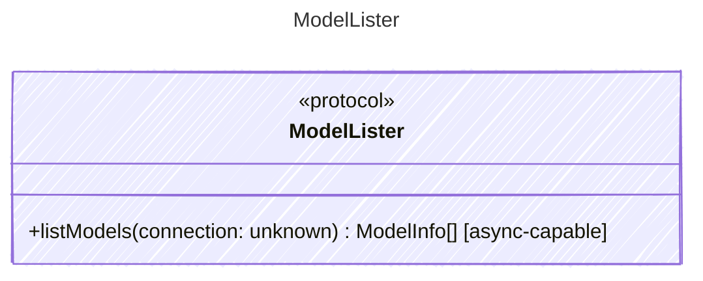

<!-- <auto-generated by typra-emitter> -->

Lists models available through a provider connection.

## Class Diagram

## Helper Methods

The following helper methods are declared via `@method` and must be implemented by every runtime. The schema declares the logical protocol contract; each runtime maps async-capable methods to idiomatic sync/async shapes for that language.

| Name | Signature | Runtime shape | Description |
| ---- | --------- | ------------- | ----------- |
| `listModels` | `listModels(connection: unknown) -> ModelInfo[]` | async-capable | List models available through a provider connection |
