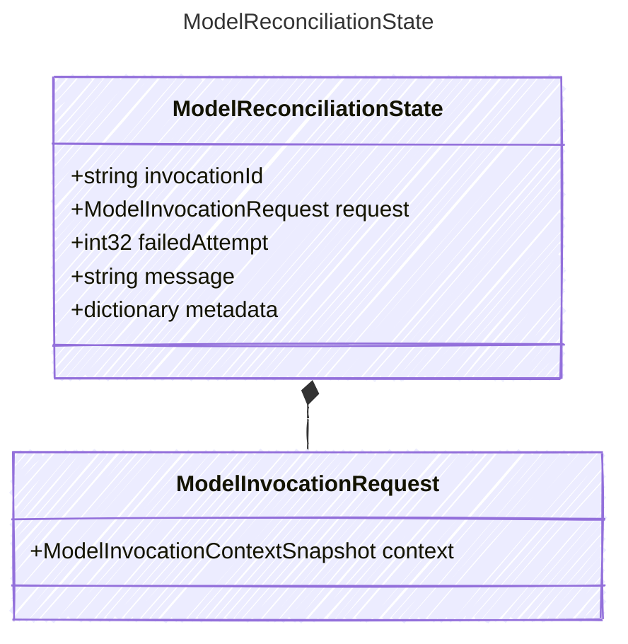

<!-- <auto-generated by typra-emitter> -->

Durable state required to reconcile one indeterminate model invocation.

Retained when a model effect completed with an unknown outcome so a resumed
run can determine success or failure without re-invoking the provider.

## Class Diagram



## Yaml Example

```yaml
invocationId: inv_abc123
message: provider connection dropped after request was sent
```

## Properties

| Name | Type | Description |
| ---- | ---- | ----------- |
| invocationId | string | Model invocation identifier awaiting reconciliation |
| request | [ModelInvocationRequest](../modelinvocationrequest/) | The request whose outcome must be reconciled |
| failedAttempt | int32 | Zero-based attempt number that failed with an unknown outcome |
| message | string | Human-readable reason the outcome is indeterminate |
| metadata | dictionary | Opaque host-specific reconciliation metadata |

## Composed Types

The following types are composed within `ModelReconciliationState`:

- [ModelInvocationRequest](../modelinvocationrequest/)
