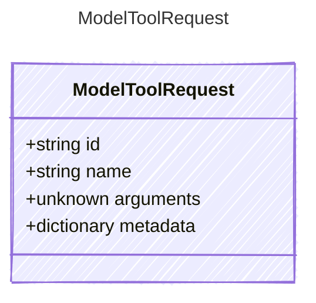

<!-- <auto-generated by typra-emitter> -->

A normalized tool request returned by a model provider.

Arguments remain JSON-shaped because providers may return a parsed object or
a serialized JSON value before the host's tool binding is selected.

## Class Diagram



## Yaml Example

```yaml
id: call_abc123
name: get_weather
```

## Properties

| Name | Type | Description |
| ---- | ---- | ----------- |
| id | string | Provider-stable tool request identifier |
| name | string | Name of the requested tool |
| arguments | unknown | Provider-normalized tool arguments |
| metadata | dictionary | Opaque provider-specific tool request metadata |
