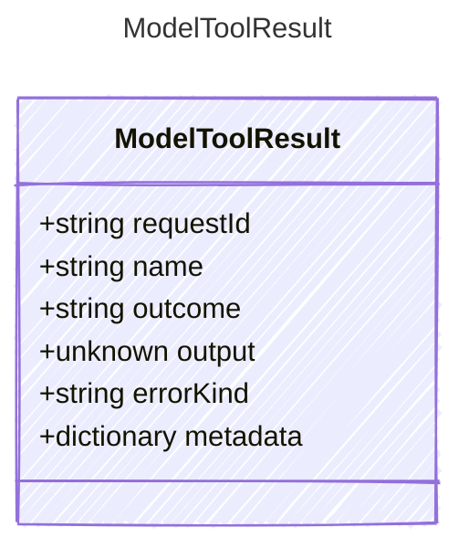

<!-- <auto-generated by typra-emitter> -->

Normalized result of executing one model-requested tool.

## Class Diagram



## Yaml Example

```yaml
requestId: call_abc123
name: get_weather
```

## Properties

| Name | Type | Description |
| ---- | ---- | ----------- |
| requestId | string | Identifier of the corresponding model tool request |
| name | string | Name of the executed tool |
| outcome | string | Semantic outcome of the external tool effect |
| output | unknown | JSON-shaped tool output when available |
| errorKind | string | Stable error category for failed or indeterminate results |
| metadata | dictionary | Opaque host-specific tool result metadata |
