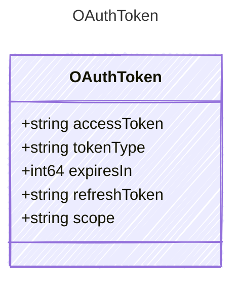

<!-- <auto-generated by typra-emitter> -->

Provider-neutral OAuth token material returned by an authorization server.

## Class Diagram

## Properties

| Name | Type | Description |
| ---- | ---- | ----------- |
| accessToken | string | The bearer access token |
| tokenType | string | The token type, typically Bearer |
| expiresIn | int64 | Lifetime of the access token in seconds |
| refreshToken | string | Refresh token when offline access was granted |
| scope | string | Scopes granted by the authorization server |
