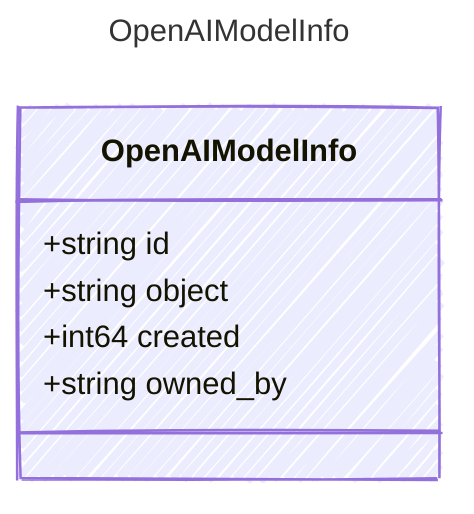

<!-- <auto-generated by typra-emitter> -->

A model entry returned by OpenAI's model listing API.

## Class Diagram

## Properties

| Name | Type | Description |
| ---- | ---- | ----------- |
| id | string | The model identifier |
| object | string | The API object type |
| created | int64 | Unix timestamp when the model was created |
| owned_by | string | The organization or user that owns the model |
