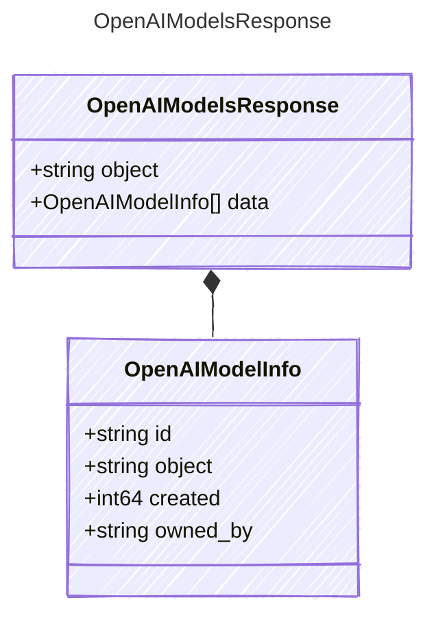

<!-- <auto-generated by typra-emitter> -->

The response body from OpenAI's model listing API.

## Class Diagram

## Properties

| Name | Type | Description |
| ---- | ---- | ----------- |
| object | string | The API object type |
| data | [OpenAIModelInfo[]](../openaimodelinfo/) | Models available to the authenticated caller |

## Composed Types

The following types are composed within `OpenAIModelsResponse`:

- [OpenAIModelInfo](../openaimodelinfo/)
