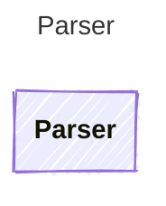

Parses rendered prompt text into an array of structured messages with role markers.

## Class Diagram

## Helper Methods

The following helper methods are declared via `@method` and must be implemented by every runtime. Idiomatic language shape (e.g. zero-param accessor may be a property) is chosen per-language by the emitter.

| Name | Signature | Description |
| ---- | --------- | ----------- |
| `preRender` | `preRender(template: string) -> unknown?` _(optional, sync)_ | Pre-process a template before rendering, returning modified template and context |
| `parse` | `parse(agent: Prompty, rendered: string, context: Record<unknown>?) -> Message[]` | Parse rendered text into a structured message array |
