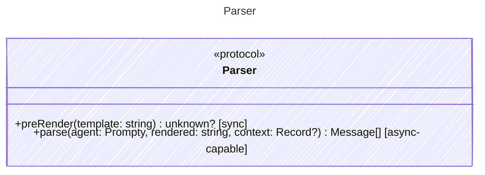

<!-- <auto-generated by typra-emitter> -->

Parses rendered prompt text into an array of structured messages with role markers.

## Class Diagram

## Helper Methods

The following helper methods are declared via `@method` and must be implemented by every runtime. The schema declares the logical protocol contract; each runtime maps async-capable methods to idiomatic sync/async shapes for that language.

| Name | Signature | Runtime shape | Description |
| ---- | --------- | ------------- | ----------- |
| `preRender` | `preRender(template: string) -> unknown?` | sync _(optional default)_ | Pre-process a template before rendering, returning modified template and context |
| `parse` | `parse(agent: Prompty, rendered: string, context: Record<unknown>?) -> Message[]` | async-capable | Parse rendered text into a structured message array |
