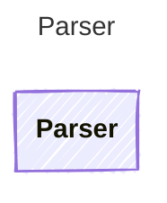

Parses rendered prompt text into an array of structured messages with role markers.

## Class Diagram

```mermaid
---
title: Parser
config:
  look: handDrawn
  theme: colorful
  class:
    hideEmptyMembersBox: true
---
classDiagram
    class Parser {
    }
```
