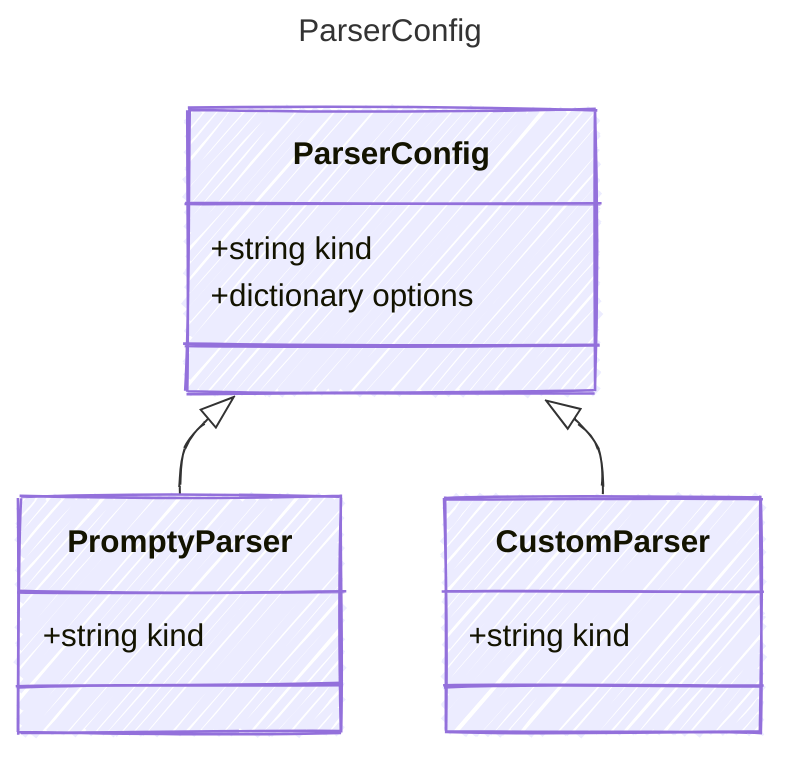

<!-- <auto-generated by typra-emitter> -->

Template parser definition. `kind` is the `@dispatch` discriminator for the
Parser seam, reached from a seam param as `agent.template.parser.kind`.

## Class Diagram



## Yaml Example

```yaml
kind: prompty
options:
  key: value
```

## Properties

| Name | Type | Description |
| ---- | ---- | ----------- |
| kind | string | Parser used to process the rendered template into API-compatible format |
| options | dictionary | Options for the parser |

## Child Types

The following types extend `ParserConfig`:

- [PromptyParser](../promptyparser/)
- [CustomParser](../customparser/)

## Alternate Constructions

The following alternate constructions are available for `ParserConfig`.
These allow for simplified creation of instances using a single property.

### string parser

Simple construction with just a "kind" string

The following simplified representation can be used:

```yaml
parser: "example"
```

This is equivalent to the full representation:

```yaml
parser:
  kind: "example"
```
