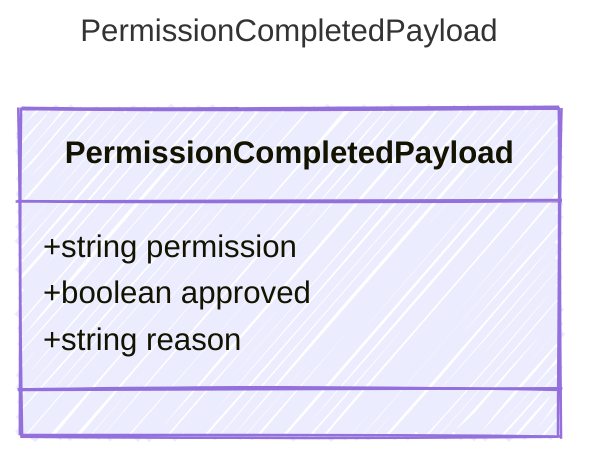

Payload for permission completion events — an approval decision was made.

## Class Diagram



## Yaml Example

```yaml
permission: tool.execute
approved: true
reason: user_approved
```

## Properties

| Name | Type | Description |
| ---- | ---- | ----------- |
| permission | string | Permission/action name that was decided |
| approved | boolean | Whether the requested permission was approved |
| reason | string | Decision reason, if available |
