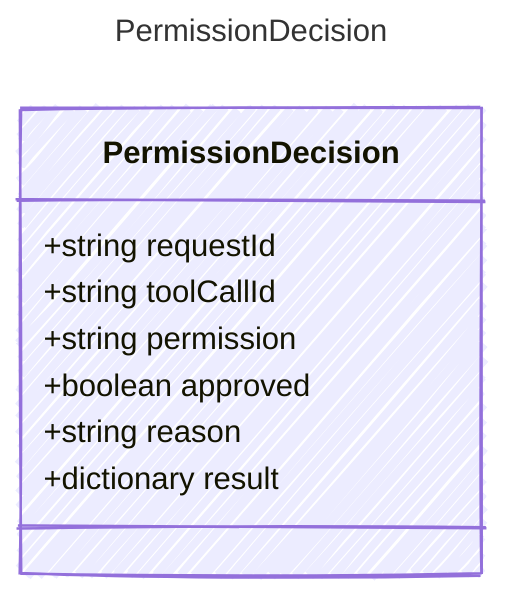

Decision returned by a permission resolver.

## Class Diagram



## Yaml Example

```yaml
requestId: perm_abc123
toolCallId: call_abc123
permission: tool.execute
approved: true
reason: user_approved
```

## Properties

| Name | Type | Description |
| ---- | ---- | ----------- |
| requestId | string | Stable permission request identifier |
| toolCallId | string | Associated tool call identifier, when the permission gated a tool call |
| permission | string | Permission/action name that was decided |
| approved | boolean | Whether the requested permission was approved |
| reason | string | Decision reason, if available |
| result | dictionary | Host-specific decision result, such as a durable approval token or denial details |
