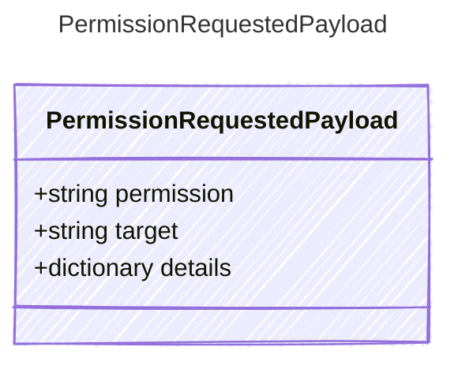

Payload for permission request events — a host is asked to approve an action.

## Class Diagram



## Yaml Example

```yaml
permission: tool.execute
target: shell
```

## Properties

| Name | Type | Description |
| ---- | ---- | ----------- |
| permission | string | Permission/action name being requested |
| target | string | Resource or tool the permission applies to |
| details | dictionary | Additional host-specific permission details |
