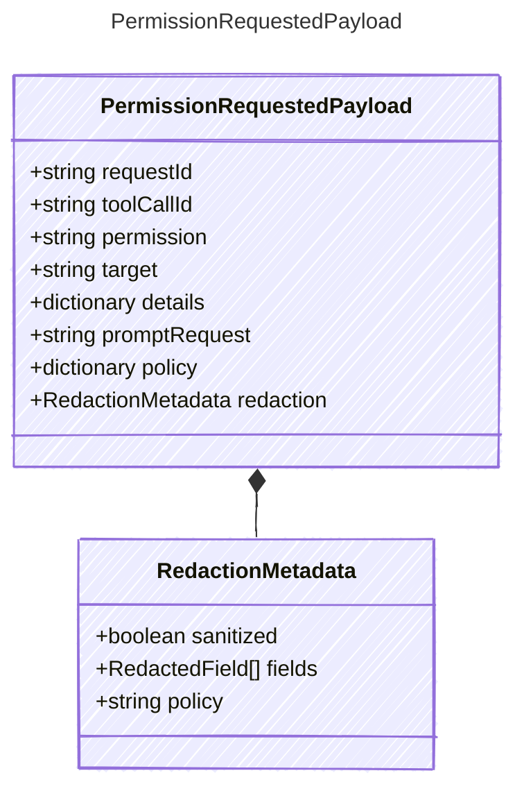

<!-- <auto-generated by typra-emitter> -->
---
title: "PermissionRequestedPayload"
description: "Documentation for the PermissionRequestedPayload type."
slug: "reference/permissionrequestedpayload"
---

Payload for permission request events — a host is asked to approve an action.

## Class Diagram



## Yaml Example

```yaml
requestId: perm_abc123
toolCallId: call_abc123
permission: tool.execute
target: shell
promptRequest: Allow shell to run tests?
```

## Properties

| Name | Type | Description |
| ---- | ---- | ----------- |
| requestId | string | Stable permission request identifier |
| toolCallId | string | Associated tool call identifier, when the permission gates a tool call |
| permission | string | Permission/action name being requested |
| target | string | Resource or tool the permission applies to |
| details | dictionary | Additional host-specific permission details |
| promptRequest | string | Human-readable prompt or rationale that can be shown to an approval UI |
| policy | dictionary | Policy metadata used to evaluate or explain the permission request |
| redaction | [RedactionMetadata](../redactionmetadata/) | Redaction state for sensitive request fields |

## Composed Types

The following types are composed within `PermissionRequestedPayload`:

- [RedactionMetadata](../redactionmetadata/)
