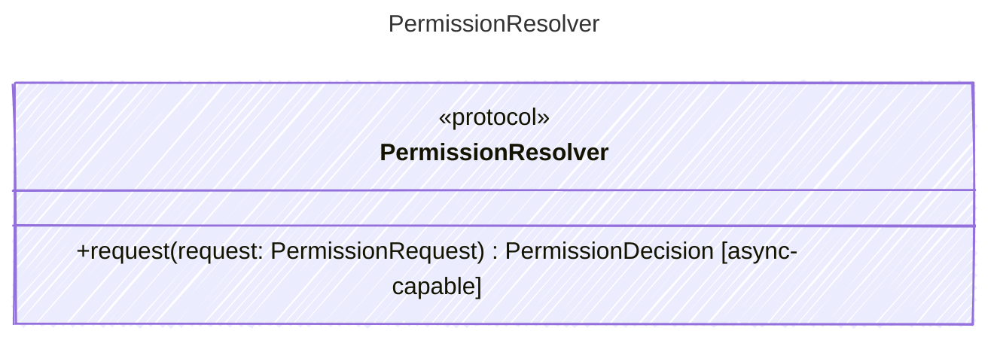

<!-- <auto-generated by typra-emitter> -->

Resolves host permission requests for potentially sensitive actions.

## Class Diagram

## Helper Methods

The following helper methods are declared via `@method` and must be implemented by every runtime. The schema declares the logical protocol contract; each runtime maps async-capable methods to idiomatic sync/async shapes for that language.

| Name | Signature | Runtime shape | Description |
| ---- | --------- | ------------- | ----------- |
| `request` | `request(request: PermissionRequest) -> PermissionDecision` | async-capable | Resolve a host permission request |
