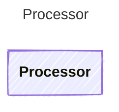

Extracts a clean, typed result from a raw LLM provider response.

## Class Diagram

## Helper Methods

The following helper methods are declared via `@method` and must be implemented by every runtime. Idiomatic language shape (e.g. zero-param accessor may be a property) is chosen per-language by the emitter.

| Name | Signature | Description |
| ---- | --------- | ----------- |
| `process` | `process(agent: Prompty, response: unknown) -> unknown` | Extract a clean result from a raw LLM response |
| `processStream` | `processStream(stream: unknown) -> unknown` _(optional)_ | Process a streaming response into a stream of StreamChunk items. Takes raw chunks from the executor and yields processed text, thinking, tool, or error chunks. Not all providers support streaming; the default implementation should signal lack of support. |
