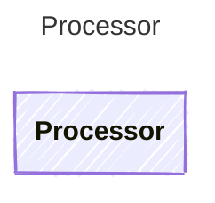

Extracts a clean, typed result from a raw LLM provider response.

## Class Diagram

```mermaid
---
title: Processor
config:
  look: handDrawn
  theme: colorful
  class:
    hideEmptyMembersBox: true
---
classDiagram
    class Processor {
    }
```
