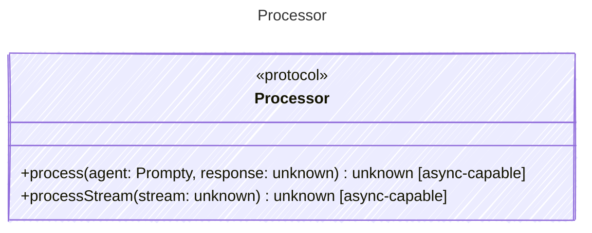

Extracts a clean, typed result from a raw LLM provider response.

## Class Diagram

## Helper Methods

The following helper methods are declared via `@method` and must be implemented by every runtime. The schema declares the logical protocol contract; each runtime maps async-capable methods to idiomatic sync/async shapes for that language.

| Name | Signature | Runtime shape | Description |
| ---- | --------- | ------------- | ----------- |
| `process` | `process(agent: Prompty, response: unknown) -> unknown` | async-capable | Extract a clean result from a raw LLM response |
| `processStream` | `processStream(stream: unknown) -> unknown` | async-capable _(optional default)_ | Process a streaming response into a stream of StreamChunk items. Takes raw chunks from the executor and yields processed text, thinking, tool, or error chunks. Not all providers support streaming; the default implementation should signal lack of support. |
