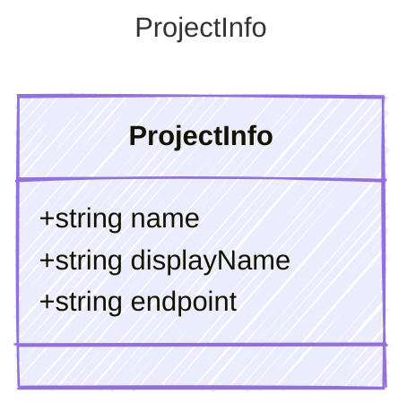

<!-- <auto-generated by typra-emitter> -->

A project hosted by an AI service resource.

## Class Diagram

## Properties

| Name | Type | Description |
| ---- | ---- | ----------- |
| name | string | Provider project name |
| displayName | string | Human-readable project name |
| endpoint | string | Project-scoped inference endpoint |
