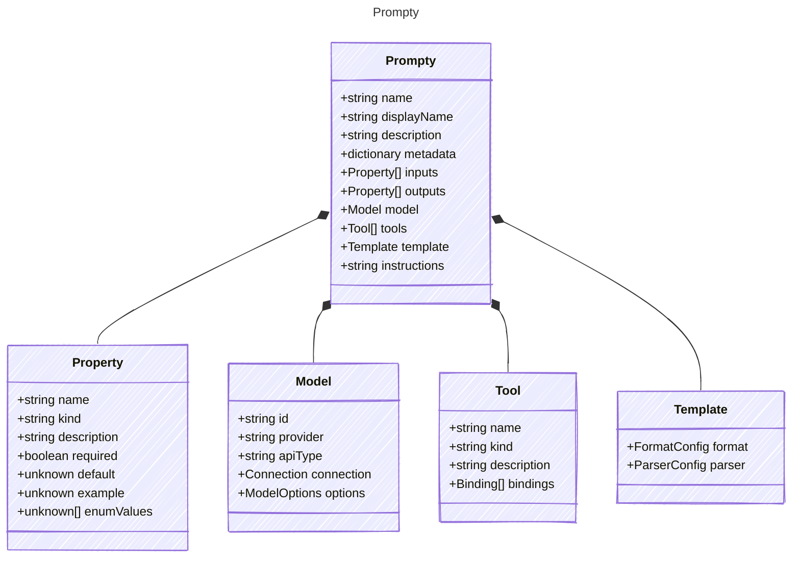

A Prompty is a markdown file format for LLM prompts. The frontmatter defines
structured metadata including model configuration, input/output schemas, tools,
and template settings. The markdown body becomes the instructions.

This is the single root type for the Prompty schema — there is no abstract base
class or kind discriminator. A .prompty file always produces a Prompty instance.

## Class Diagram



## Markdown Example

```markdown
---
name: basic-prompt
displayName: Basic Prompt
description: A basic prompt that uses the GPT-3 chat API to answer questions
metadata:
  authors:
    - sethjuarez
    - jietong
  tags:
    - example
    - prompt
inputs:
  firstName:
    kind: string
    default: Jane
  lastName:
    kind: string
    default: Doe
  question:
    kind: string
    default: What is the meaning of life?
outputs:
  answer:
    kind: string
    description: The answer to the user's question.
model:
  id: gpt-35-turbo
  connection:
    kind: key
    endpoint: https://{your-custom-endpoint}.openai.azure.com/
    apiKey: "{your-api-key}"
tools:
  - name: getCurrentWeather
    kind: function
    description: Get the current weather in a given location
    parameters:
      location:
        kind: string
        description: The city and state, e.g. San Francisco, CA
      unit:
        kind: string
        description: The unit of temperature, e.g. Celsius or Fahrenheit
template:
  format: mustache
  parser: prompty
---
system:
You are an AI assistant who helps people find information.
As the assistant, you answer questions briefly, succinctly,
and in a personable manner using markdown and even add some 
personal flair with appropriate emojis.

# Customer
You are helping {{firstName}} {{lastName}} to find answers to 
their questions. Use their name to address them in your responses.
user:
{{question}}
```

## Yaml Example

```yaml
name: basic-prompt
displayName: Basic Prompt
description: A basic prompt that uses the GPT-3 chat API to answer questions
metadata:
  authors:
    - sethjuarez
    - jietong
  tags:
    - example
    - prompt
inputs:
  firstName:
    kind: string
    default: Jane
  lastName:
    kind: string
    default: Doe
  question:
    kind: string
    default: What is the meaning of life?
outputs:
  answer:
    kind: string
    description: The answer to the user's question.
model:
  id: gpt-35-turbo
  connection:
    kind: key
    endpoint: https://{your-custom-endpoint}.openai.azure.com/
    apiKey: "{your-api-key}"
tools:
  - name: getCurrentWeather
    kind: function
    description: Get the current weather in a given location
    parameters:
      location:
        kind: string
        description: The city and state, e.g. San Francisco, CA
      unit:
        kind: string
        description: The unit of temperature, e.g. Celsius or Fahrenheit
template:
  format: mustache
  parser: prompty
instructions: |-
  system:
  You are an AI assistant who helps people find information.
  As the assistant, you answer questions briefly, succinctly,
  and in a personable manner using markdown and even add some 
  personal flair with appropriate emojis.

  # Customer
  You are helping {{firstName}} {{lastName}} to find answers to 
  their questions. Use their name to address them in your responses.
  user:
  {{question}}
```

## Properties

| Name | Type | Description |
| ---- | ---- | ----------- |
| name | string | Human-readable name of the prompt |
| displayName | string | Display name for UI purposes |
| description | string | Description of the prompt&#39;s purpose |
| metadata | dictionary | Additional metadata including authors, tags, and other arbitrary properties |
| inputs | [Property[]](../property/) | Input parameters that participate in template rendering(Related Types: [ArrayProperty](../arrayproperty/), [ObjectProperty](../objectproperty/)) |
| outputs | [Property[]](../property/) | Expected output format and structure |
| model | [Model](../model/) | AI model configuration |
| tools | [Tool[]](../tool/) | Tools available for extended functionality(Related Types: [FunctionTool](../functiontool/), [CustomTool](../customtool/), [McpTool](../mcptool/), [OpenApiTool](../openapitool/), [PromptyTool](../promptytool/)) |
| template | [Template](../template/) | Template configuration for prompt rendering |
| instructions | string | Clear directions on what the prompt should do. In .prompty files, this comes from the markdown body. |

## Composed Types

The following types are composed within `Prompty`:

- [Property](../property/)
- [Model](../model/)
- [Tool](../tool/)
- [Template](../template/)
