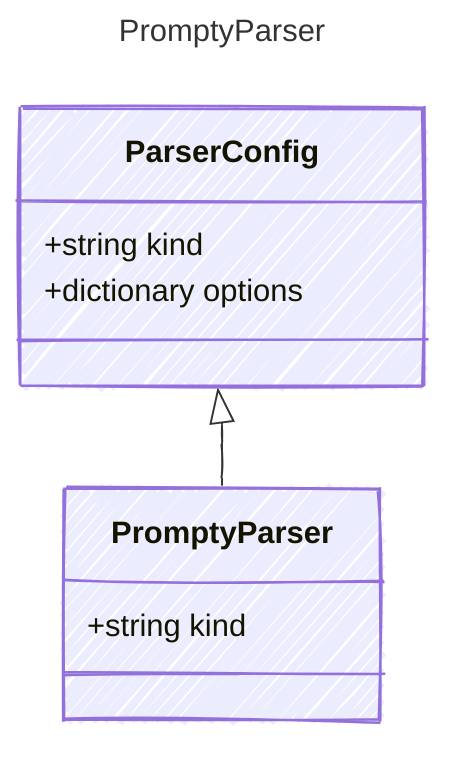

<!-- <auto-generated by typra-emitter> -->

The default Prompty chat parser. Pin-only subtype.

## Class Diagram

## Properties

| Name | Type | Description |
| ---- | ---- | ----------- |
| kind | string | The Prompty parser discriminator |
