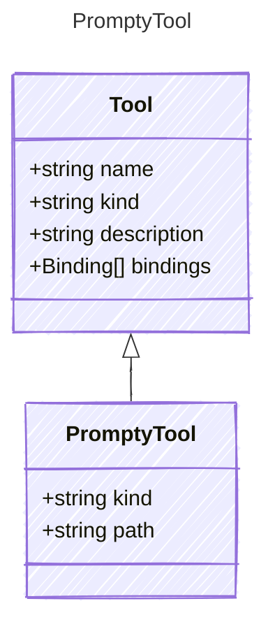

A tool that references another .prompty file to be invoked as a tool.

PromptyTool is always single-shot — the child prompty is loaded, rendered,
and executed with a single LLM call (invoke). It does NOT run an agent loop.

Applications that need agentic sub-agent delegation should register
`kind: function` tools that internally call `turn()` with their own TurnOptions.

## Class Diagram



## Yaml Example

```yaml
kind: prompty
path: ./summarize.prompty
```

## Properties

| Name | Type | Description |
| ---- | ---- | ----------- |
| kind | string | The kind identifier for prompty tools |
| path | string | Path to the child .prompty file, relative to the parent |
