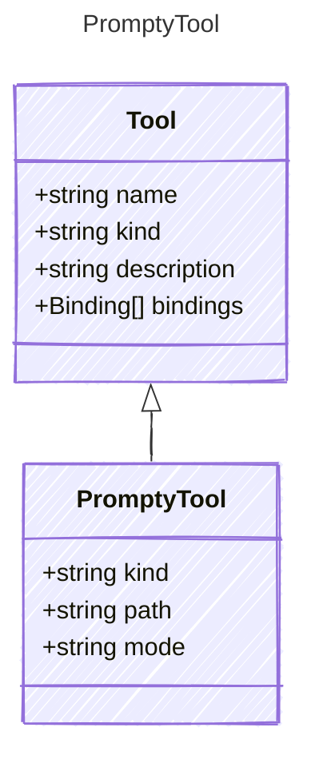

A tool that references another .prompty file to be invoked as a tool.

In `single` mode, the child prompty is executed with a single LLM call.
In `agentic` mode, the child prompty runs a full agent loop with its own tools.

## Class Diagram



## Yaml Example

```yaml
kind: prompty
path: ./summarize.prompty
mode: single
```

## Properties

| Name | Type | Description |
| ---- | ---- | ----------- |
| kind | string | The kind identifier for prompty tools |
| path | string | Path to the child .prompty file, relative to the parent |
| mode | string | Execution mode: &#39;single&#39; for one LLM call, &#39;agentic&#39; for full agent loop |
