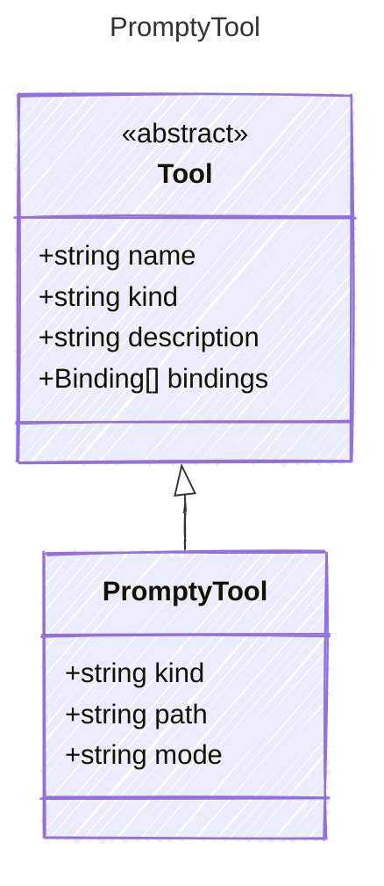

<!-- <auto-generated by typra-emitter> -->
---
title: "PromptyTool"
description: "Documentation for the PromptyTool type."
slug: "reference/promptytool"
---

A tool that references another .prompty file to be invoked as a tool.

The child prompty is executed as a single prompt invocation. Nested agent
loops are intentionally not started from PromptyTool.

## Class Diagram



## Yaml Example

```yaml
kind: prompty
path: ./summarize.prompty
mode: single
```

## Properties

| Name | Type | Description |
| ---- | ---- | ----------- |
| kind | string | The kind identifier for prompty tools |
| path | string | Path to the child .prompty file, relative to the parent |
| mode | string | Execution mode. Only 'single' is supported; nested agent loops are not started from PromptyTool. |
