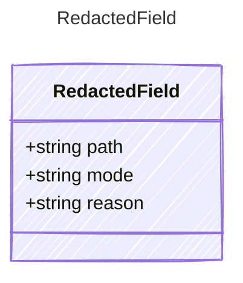

<!-- <auto-generated by typra-emitter> -->

Redaction handling for one JSON-shaped field path.

## Class Diagram



## Yaml Example

```yaml
path: $.arguments.apiKey
mode: redacted
reason: secret
```

## Properties

| Name | Type | Description |
| ---- | ---- | ----------- |
| path | string | JSONPath-like field path, relative to the containing payload |
| mode | string | How the field was represented |
| reason | string | Human-readable reason or policy that caused this handling |
