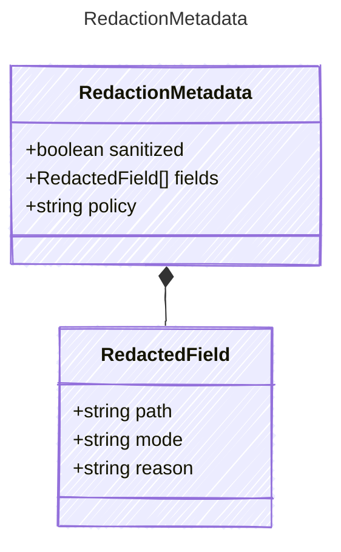

<!-- <auto-generated by typra-emitter> -->
---
title: "RedactionMetadata"
description: "Documentation for the RedactionMetadata type."
slug: "reference/redactionmetadata"
---

Metadata describing whether and how a payload was sanitized.

## Class Diagram



## Yaml Example

```yaml
sanitized: true
policy: default-v1
```

## Properties

| Name | Type | Description |
| ---- | ---- | ----------- |
| sanitized | boolean | Whether the payload has been sanitized for persistence or external display |
| fields | [RedactedField[]](../redactedfield/) | Field-level redaction details |
| policy | string | Host policy or sanitizer version that produced this metadata |

## Composed Types

The following types are composed within `RedactionMetadata`:

- [RedactedField](../redactedfield/)
