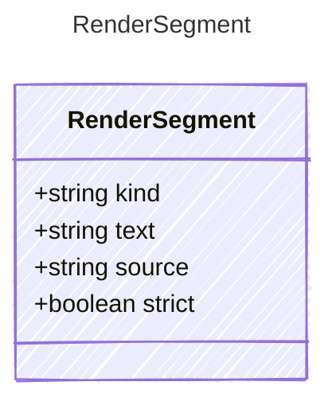

<!-- <auto-generated by typra-emitter> -->

One provenance-tagged span of rendered output (Prompty Jinja Subset §7,
spec/jinja-grammar.md). Concatenating every segment's `text` in source order
yields the flat string returned by `render`, so `renderSegments` is the
provenance-carrying superset of `render`.

`literal` spans originate in the template source; `interp` spans originate in
an interpolated input value and carry the originating root property `source`.
That provenance lets a downstream structural parser distinguish an
author-authored role boundary from one forged inside untrusted input — the
injection-deterrence contract that replaces in-band sentinel scanning. A span
whose `source` property is declared strict is flagged `strict`; a strict span
that forges a role boundary is rejected loudly rather than emitted.

## Class Diagram

## Properties

| Name | Type | Description |
| ---- | ---- | ----------- |
| kind | string | Whether this span came from the template (literal) or an input value (interp) |
| text | string | The rendered text of this span |
| source | string | For interp spans, the root input property the value came from |
| strict | boolean | Whether the originating input property is declared strict |
