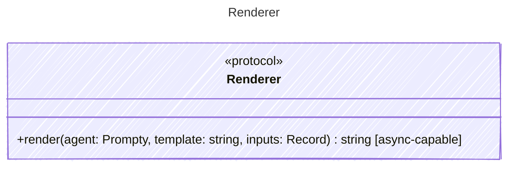

Renders a template string with input values to produce the final prompt text.

## Class Diagram

## Helper Methods

The following helper methods are declared via `@method` and must be implemented by every runtime. The schema declares the logical protocol contract; each runtime maps async-capable methods to idiomatic sync/async shapes for that language.

| Name | Signature | Runtime shape | Description |
| ---- | --------- | ------------- | ----------- |
| `render` | `render(agent: Prompty, template: string, inputs: Record<unknown>) -> string` | async-capable | Render the template string with input values |
