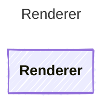

Renders a template string with input values to produce the final prompt text.

## Class Diagram

## Helper Methods

The following helper methods are declared via `@method` and must be implemented by every runtime. Idiomatic language shape (e.g. zero-param accessor may be a property) is chosen per-language by the emitter.

| Name | Signature | Description |
| ---- | --------- | ----------- |
| `render` | `render(agent: Prompty, template: string, inputs: Record<unknown>) -> string` | Render the template string with input values |
