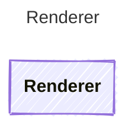

Renders a template string with input values to produce the final prompt text.

## Class Diagram

```mermaid
---
title: Renderer
config:
  look: handDrawn
  theme: colorful
  class:
    hideEmptyMembersBox: true
---
classDiagram
    class Renderer {
    }
```
