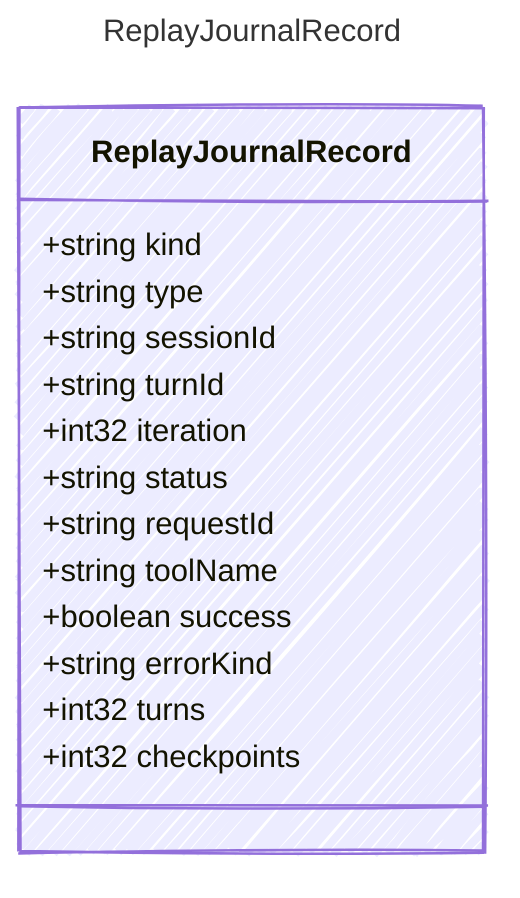

<!-- <auto-generated by typra-emitter> -->

Stable, replay-comparable projection of a journal record.

Runtime journal records may carry additional payload fields, durations, telemetry,
or provider-specific data. Replay verification compares this normalized shape so
deterministic orchestration semantics are mechanically shared across runtimes.

## Class Diagram

## Properties

| Name | Type | Description |
| ---- | ---- | ----------- |
| kind | string | Journal record kind |
| type | string | Turn or session event type, when kind is not summary |
| sessionId | string | Stable harness session identifier |
| turnId | string | Stable turn identifier within the session |
| iteration | int32 | Zero-based model loop iteration for turn records |
| status | string | Final semantic status for turn/session/summary records |
| requestId | string | Permission request identifier for permission request records |
| toolName | string | Host tool name for tool execution/result records |
| success | boolean | Whether a permission or host tool operation succeeded |
| errorKind | string | Stable error discriminator for failed records |
| turns | int32 | Number of turns represented by a summary record |
| checkpoints | int32 | Number of checkpoints represented by a summary record |
