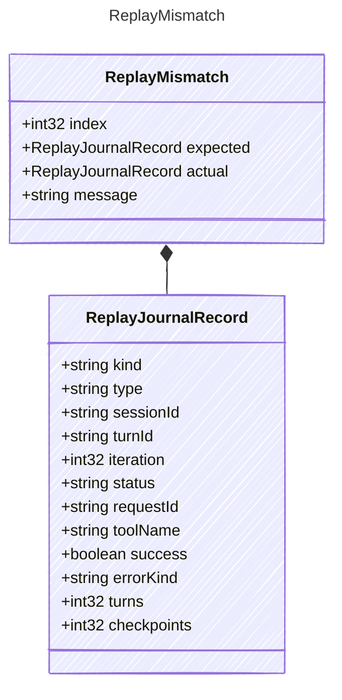

<!-- <auto-generated by typra-emitter> -->

A single mismatch produced by replay verification.

## Class Diagram

## Properties

| Name | Type | Description |
| ---- | ---- | ----------- |
| index | int32 | Zero-based record index where the mismatch was found |
| expected | [ReplayJournalRecord](../replayjournalrecord/) | Expected record at this index, when present |
| actual | [ReplayJournalRecord](../replayjournalrecord/) | Actual record at this index, when present |
| message | string | Human-readable mismatch explanation |

## Composed Types

The following types are composed within `ReplayMismatch`:

- [ReplayJournalRecord](../replayjournalrecord/)
