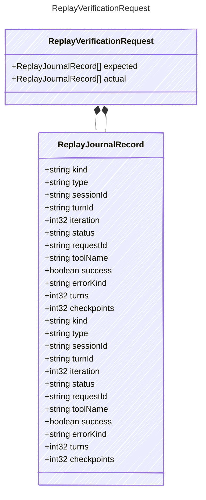

<!-- <auto-generated by typra-emitter> -->

Request accepted by a replay verifier implementation.

## Class Diagram

## Properties

| Name | Type | Description |
| ---- | ---- | ----------- |
| expected | [ReplayJournalRecord[]](../replayjournalrecord/) | Expected normalized replay records |
| actual | [ReplayJournalRecord[]](../replayjournalrecord/) | Actual normalized replay records |

## Composed Types

The following types are composed within `ReplayVerificationRequest`:

- [ReplayJournalRecord](../replayjournalrecord/)
- [ReplayJournalRecord](../replayjournalrecord/)
