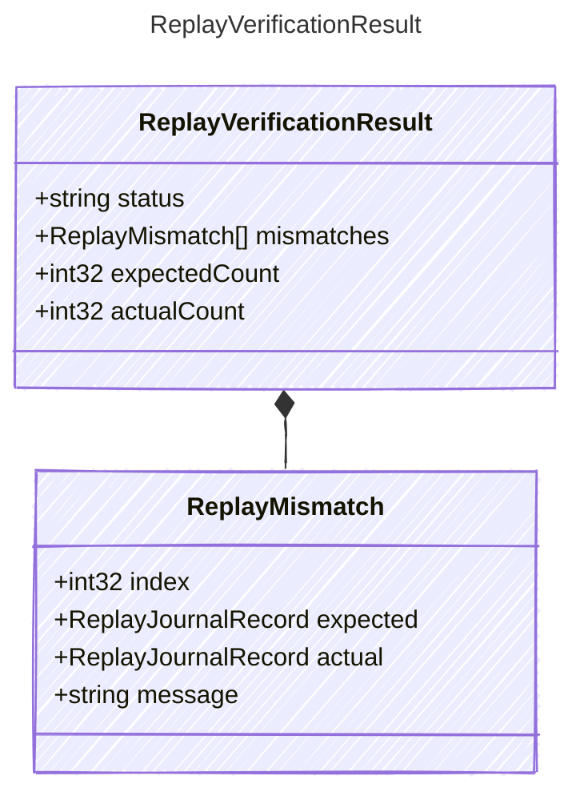

<!-- <auto-generated by typra-emitter> -->

Result returned by a replay verifier implementation.

## Class Diagram

## Properties

| Name | Type | Description |
| ---- | ---- | ----------- |
| status | string | Replay verification status |
| mismatches | [ReplayMismatch[]](../replaymismatch/) | Record mismatches, empty when verification passed |
| expectedCount | int32 | Number of expected records |
| actualCount | int32 | Number of actual records |

## Composed Types

The following types are composed within `ReplayVerificationResult`:

- [ReplayMismatch](../replaymismatch/)
