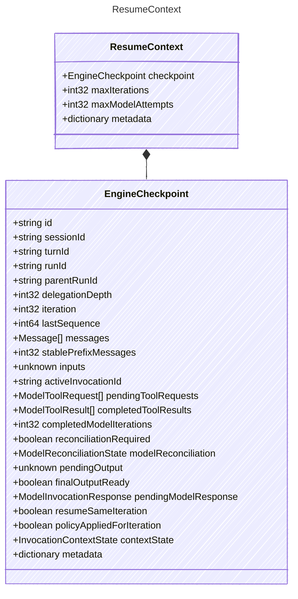

<!-- <auto-generated by typra-emitter> -->

Input that drives resuming a turn from a durable checkpoint.

A host supplies this to restart an interrupted turn without duplicating a
committed model or tool effect.

## Class Diagram

## Properties

| Name | Type | Description |
| ---- | ---- | ----------- |
| checkpoint | [EngineCheckpoint](../enginecheckpoint/) | Checkpoint to resume from |
| maxIterations | int32 | Maximum model loop iterations permitted for the resumed run |
| maxModelAttempts | int32 | Maximum model attempts permitted per invocation in the resumed run |
| metadata | dictionary | Opaque host-specific resume metadata |

## Composed Types

The following types are composed within `ResumeContext`:

- [EngineCheckpoint](../enginecheckpoint/)
