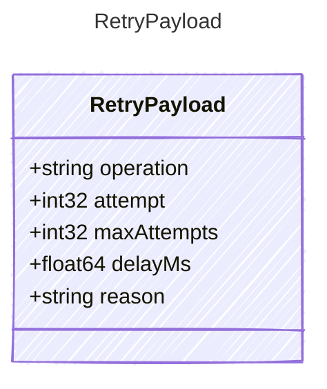

<!-- <auto-generated by typra-emitter> -->
---
title: "RetryPayload"
description: "Documentation for the RetryPayload type."
slug: "reference/retrypayload"
---

Payload for "retry" events — a transient operation will be retried.

## Class Diagram



## Yaml Example

```yaml
operation: llm
attempt: 2
maxAttempts: 3
delayMs: 1250
reason: rate_limit
```

## Properties

| Name | Type | Description |
| ---- | ---- | ----------- |
| operation | string | Operation being retried |
| attempt | int32 | Attempt number about to run |
| maxAttempts | int32 | Maximum configured attempts |
| delayMs | float64 | Backoff delay before the next attempt in milliseconds |
| reason | string | Reason for the retry |
