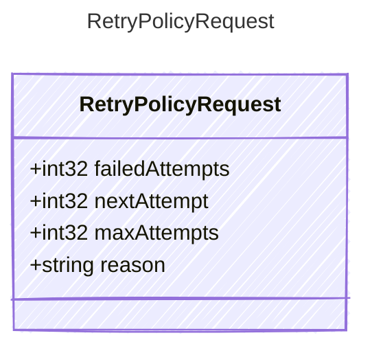

<!-- <auto-generated by typra-emitter> -->

Context supplied to the retry policy after a retryable model failure.

## Class Diagram

## Properties

| Name | Type | Description |
| ---- | ---- | ----------- |
| failedAttempts | int32 | Number of failures observed for this invocation, starting at one |
| nextAttempt | int32 | One-based attempt number that will run after backoff |
| maxAttempts | int32 | Maximum attempts permitted for the invocation |
| reason | string | Human-readable reason for the retry |
