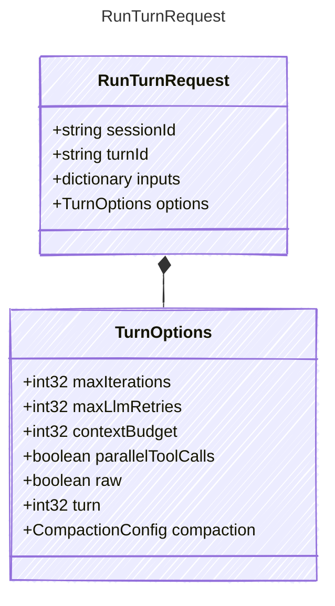

<!-- <auto-generated by typra-emitter> -->

Request accepted by a reference turn runner implementation.

## Class Diagram



## Yaml Example

```yaml
sessionId: sess_abc123
turnId: turn_abc123
```

## Properties

| Name | Type | Description |
| ---- | ---- | ----------- |
| sessionId | string | Stable harness session identifier |
| turnId | string | Stable turn identifier within the session |
| inputs | dictionary | Inputs supplied to the deterministic single-turn run |
| options | [TurnOptions](../turnoptions/) | Canonical turn execution options |

## Composed Types

The following types are composed within `RunTurnRequest`:

- [TurnOptions](../turnoptions/)
