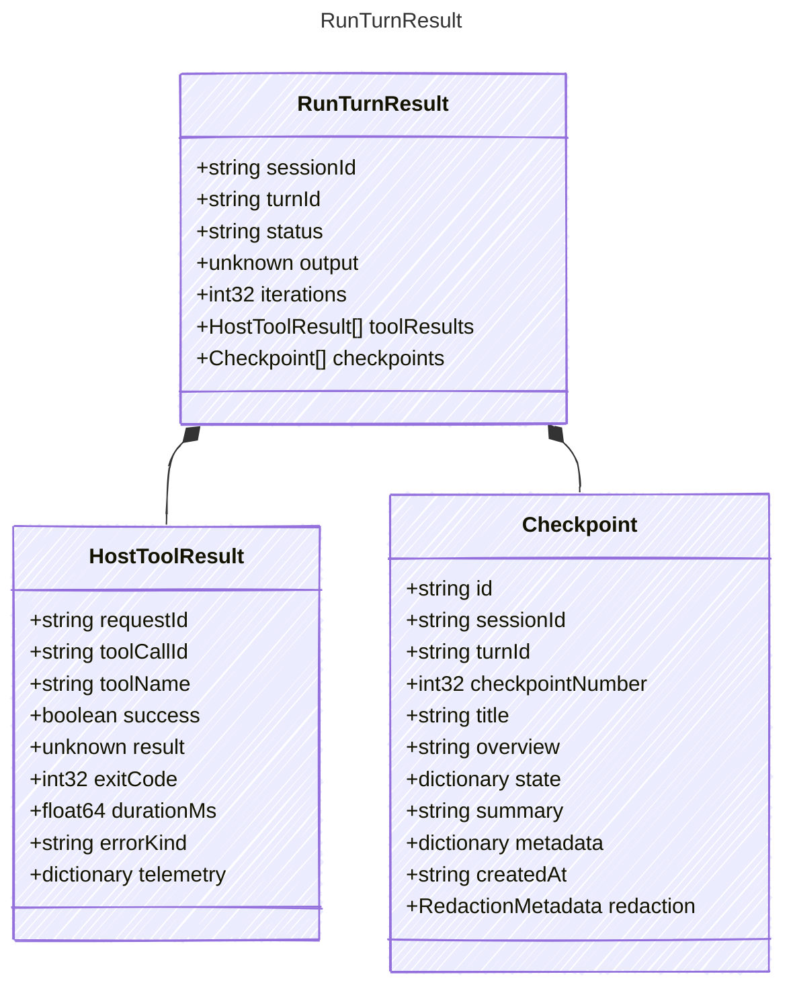

<!-- <auto-generated by typra-emitter> -->

Result returned by a reference turn runner implementation.

## Class Diagram



## Yaml Example

```yaml
sessionId: sess_abc123
turnId: turn_abc123
iterations: 1
```

## Properties

| Name | Type | Description |
| ---- | ---- | ----------- |
| sessionId | string | Stable harness session identifier |
| turnId | string | Stable turn identifier within the session |
| status | string | Final semantic status for the deterministic turn |
| output | unknown | Provider-neutral final output returned by the injected model callback |
| iterations | int32 | Number of model loop iterations executed |
| toolResults | [HostToolResult[]](../hosttoolresult/) | Host tool results produced during the turn |
| checkpoints | [Checkpoint[]](../checkpoint/) | Checkpoints created during the turn |

## Composed Types

The following types are composed within `RunTurnResult`:

- [HostToolResult](../hosttoolresult/)
- [Checkpoint](../checkpoint/)
