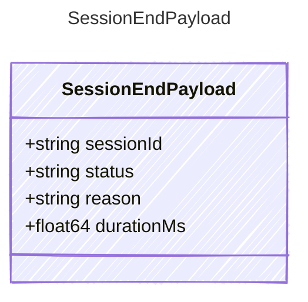

<!-- <auto-generated by typra-emitter> -->
---
title: "SessionEndPayload"
description: "Documentation for the SessionEndPayload type."
slug: "reference/sessionendpayload"
---

Payload for "session_end" events.

## Class Diagram



## Yaml Example

```yaml
sessionId: sess_abc123
status: success
reason: complete
durationMs: 12500
```

## Properties

| Name | Type | Description |
| ---- | ---- | ----------- |
| sessionId | string | Stable session identifier |
| status | string | Final session status |
| reason | string | Host-specific reason the session ended |
| durationMs | float64 | Total elapsed session duration in milliseconds |
