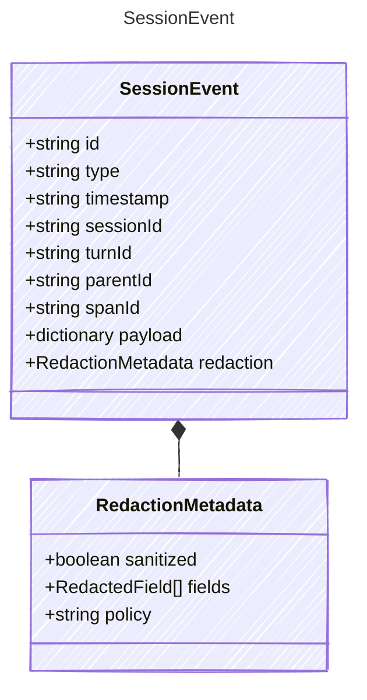

<!-- <auto-generated by typra-emitter> -->

A canonical event envelope emitted by an outer harness session.

## Class Diagram



## Yaml Example

```yaml
id: evt_abc123
timestamp: 2026-06-09T20:00:00Z
sessionId: sess_abc123
turnId: turn_001
parentId: evt_parent
spanId: span_hook_001
```

## Properties

| Name | Type | Description |
| ---- | ---- | ----------- |
| id | string | Unique identifier for this event |
| type | string | Event type discriminator |
| timestamp | string | ISO 8601 UTC timestamp when the event was emitted |
| sessionId | string | Stable identifier for the outer session |
| turnId | string | Associated turn identifier, when this session event is linked to a turn |
| parentId | string | Parent event or span identifier for reconstructing event hierarchy |
| spanId | string | Trace span identifier associated with this event |
| payload | dictionary | Event-specific payload. Use the typed payload model matching 'type'. |
| redaction | [RedactionMetadata](../redactionmetadata/) | Redaction state for sensitive payload fields |

## Composed Types

The following types are composed within `SessionEvent`:

- [RedactionMetadata](../redactionmetadata/)
