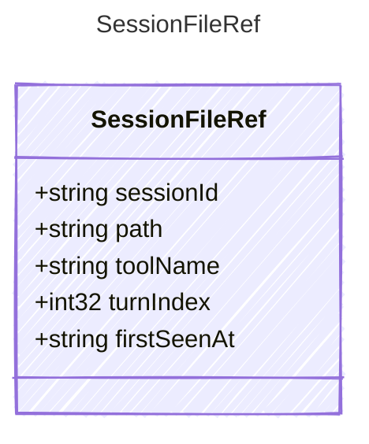

<!-- <auto-generated by typra-emitter> -->

A file observed or touched by a harness session.

## Class Diagram



## Yaml Example

```yaml
sessionId: sess_abc123
path: src/index.ts
toolName: view
turnIndex: 2
firstSeenAt: 2026-06-09T20:00:00Z
```

## Properties

| Name | Type | Description |
| ---- | ---- | ----------- |
| sessionId | string | Stable session identifier |
| path | string | File path, relative to the harness workspace when possible |
| toolName | string | Tool that first observed the file, when known |
| turnIndex | int32 | Zero-based turn index where the file was first observed |
| firstSeenAt | string | ISO 8601 UTC timestamp when the file was first observed |
