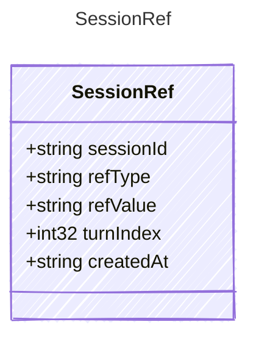

<!-- <auto-generated by typra-emitter> -->

A non-file reference observed by a harness session.

## Class Diagram



## Yaml Example

```yaml
sessionId: sess_abc123
refType: issue
refValue: owner/repo#123
turnIndex: 2
createdAt: 2026-06-09T20:00:00Z
```

## Properties

| Name | Type | Description |
| ---- | ---- | ----------- |
| sessionId | string | Stable session identifier |
| refType | string | Reference category |
| refValue | string | Reference value |
| turnIndex | int32 | Zero-based turn index where the reference was first observed |
| createdAt | string | ISO 8601 UTC timestamp when the reference was recorded |
