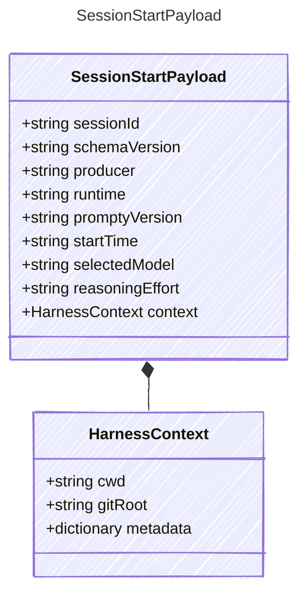

<!-- <auto-generated by typra-emitter> -->
---
title: "SessionStartPayload"
description: "Documentation for the SessionStartPayload type."
slug: "reference/sessionstartpayload"
---

Payload for "session_start" events.

## Class Diagram



## Yaml Example

```yaml
sessionId: sess_abc123
schemaVersion: "1"
producer: prompty-agent
runtime: typescript
promptyVersion: 2.0.0
startTime: 2026-06-09T20:00:00Z
selectedModel: gpt-4o-mini
reasoningEffort: medium
```

## Properties

| Name | Type | Description |
| ---- | ---- | ----------- |
| sessionId | string | Stable session identifier |
| schemaVersion | string | Session event schema version |
| producer | string | Producer that started the session |
| runtime | string | Runtime that produced the session |
| promptyVersion | string | Prompty library version |
| startTime | string | ISO 8601 UTC timestamp when the session started |
| selectedModel | string | Selected model identifier, when known |
| reasoningEffort | string | Selected reasoning effort or equivalent model setting, when known |
| context | [HarnessContext](../harnesscontext/) | Repository and execution context |

## Composed Types

The following types are composed within `SessionStartPayload`:

- [HarnessContext](../harnesscontext/)
