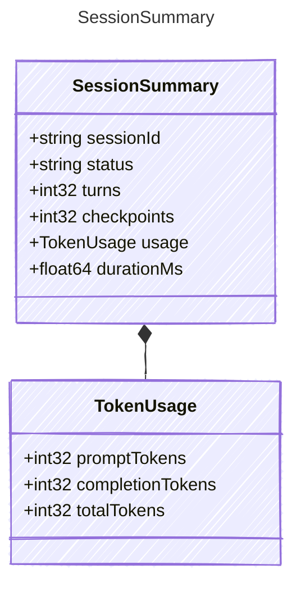

Summary statistics for a completed session trace.

## Class Diagram



## Yaml Example

```yaml
sessionId: sess_abc123
status: success
turns: 5
checkpoints: 2
durationMs: 12500
```

## Properties

| Name | Type | Description |
| ---- | ---- | ----------- |
| sessionId | string | Stable session identifier |
| status | string | Final session status |
| turns | int32 | Number of user/assistant turns in the session |
| checkpoints | int32 | Number of checkpoints created |
| usage | [TokenUsage](../tokenusage/) | Aggregated token usage for the session |
| durationMs | float64 | Total elapsed session duration in milliseconds |

## Composed Types

The following types are composed within `SessionSummary`:

- [TokenUsage](../tokenusage/)
