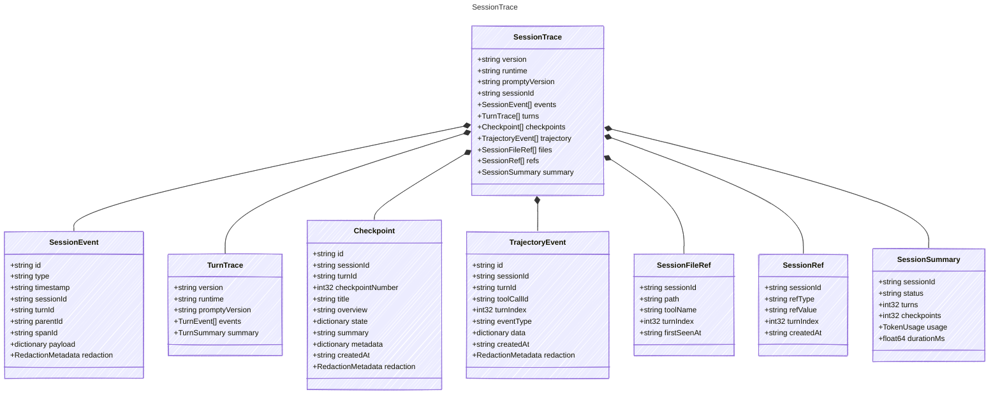

<!-- <auto-generated by typra-emitter> -->
---
title: "SessionTrace"
description: "Documentation for the SessionTrace type."
slug: "reference/sessiontrace"
---

Portable replay container for an outer harness session.

## Class Diagram



## Yaml Example

```yaml
version: "1"
runtime: typescript
promptyVersion: 2.0.0
sessionId: sess_abc123
```

## Properties

| Name | Type | Description |
| ---- | ---- | ----------- |
| version | string | Trace schema version |
| runtime | string | Runtime name that produced the trace |
| promptyVersion | string | Prompty library version that produced the trace |
| sessionId | string | Stable session identifier |
| events | [SessionEvent[]](../sessionevent/) | Recorded session events in emission order |
| turns | [TurnTrace[]](../turntrace/) | Recorded turn traces associated with the session |
| checkpoints | [Checkpoint[]](../checkpoint/) | Checkpoints created during the session |
| trajectory | [TrajectoryEvent[]](../trajectoryevent/) | Compact trajectory records associated with the session |
| files | [SessionFileRef[]](../sessionfileref/) | Files observed or touched during the session |
| refs | [SessionRef[]](../sessionref/) | Non-file references observed during the session |
| summary | [SessionSummary](../sessionsummary/) | Optional summary computed from the event stream |

## Composed Types

The following types are composed within `SessionTrace`:

- [SessionEvent](../sessionevent/)
- [TurnTrace](../turntrace/)
- [Checkpoint](../checkpoint/)
- [TrajectoryEvent](../trajectoryevent/)
- [SessionFileRef](../sessionfileref/)
- [SessionRef](../sessionref/)
- [SessionSummary](../sessionsummary/)
