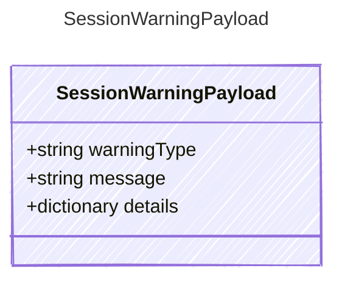

Payload for "session_warning" events.

## Class Diagram



## Yaml Example

```yaml
warningType: remote
message: Remote session disabled
```

## Properties

| Name | Type | Description |
| ---- | ---- | ----------- |
| warningType | string | Stable machine-readable warning category |
| message | string | Human-readable warning message |
| details | dictionary | Additional host-specific warning details |
