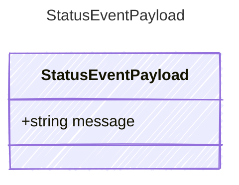

Payload for "status" events — informational messages about loop progress.

## Class Diagram



## Yaml Example

```yaml
message: Starting iteration 3
```

## Properties

| Name | Type | Description |
| ---- | ---- | ----------- |
| message | string | Human-readable status message |
