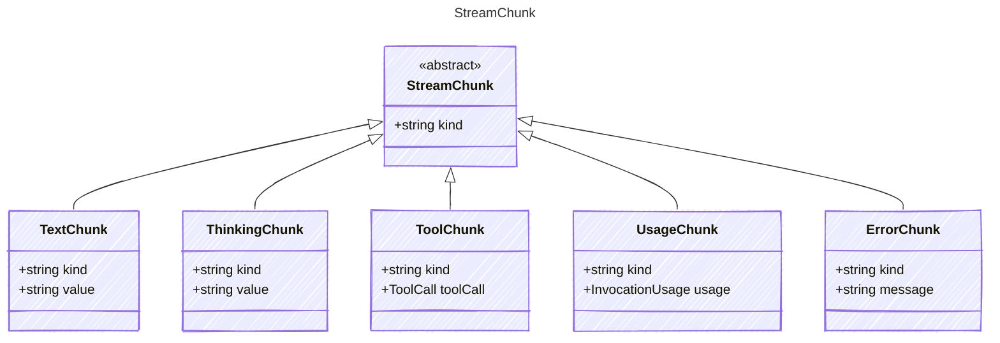

<!-- <auto-generated by typra-emitter> -->

A chunk of data from a streaming LLM response. Stream chunks are
discriminated on the `kind` field.

## Class Diagram

## Properties

| Name | Type | Description |
| ---- | ---- | ----------- |
| kind | string | The kind of stream chunk |

## Child Types

The following types extend `StreamChunk`:

- [TextChunk](../textchunk/)
- [ThinkingChunk](../thinkingchunk/)
- [ToolChunk](../toolchunk/)
- [UsageChunk](../usagechunk/)
- [ErrorChunk](../errorchunk/)
